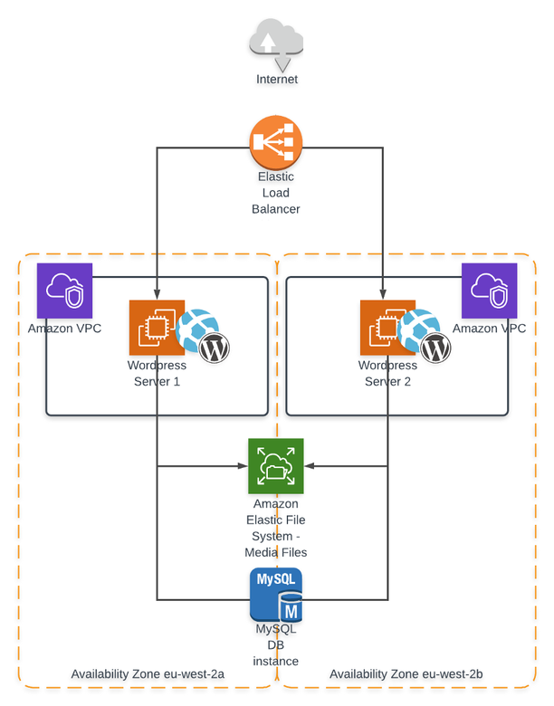
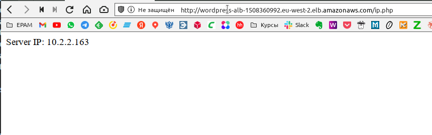
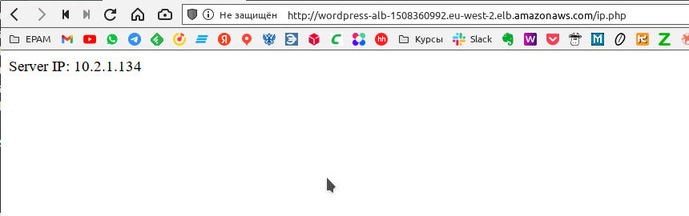
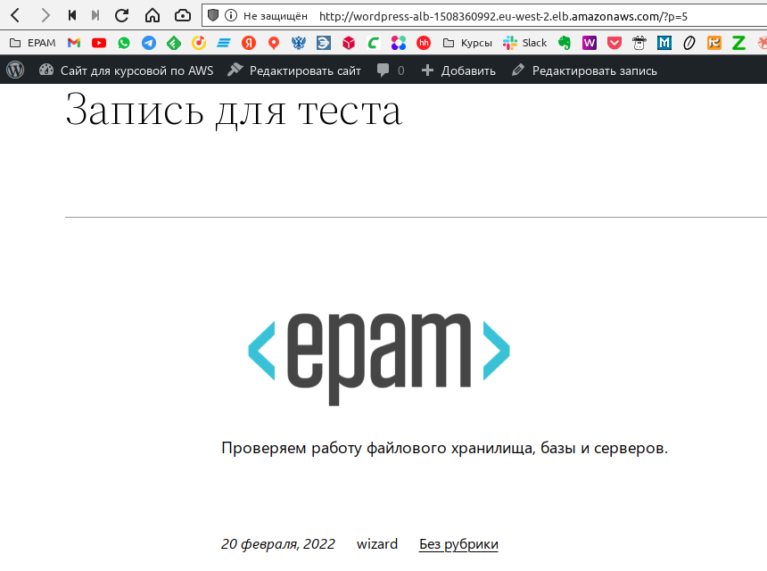
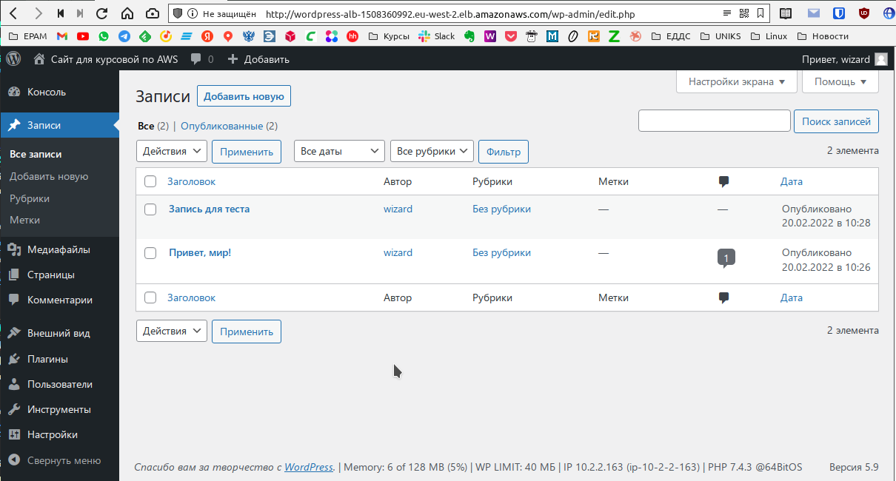
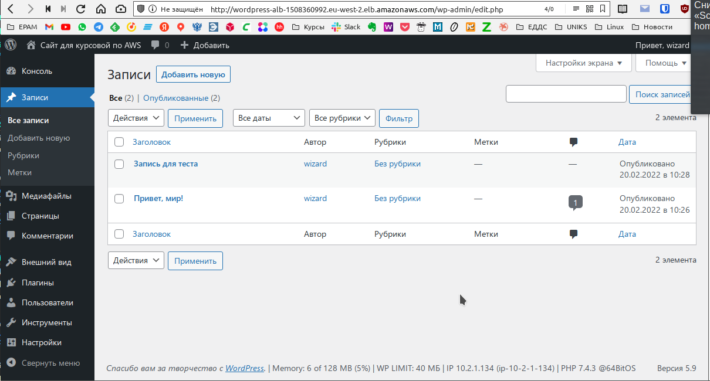

# EPAM [Lab] DevOps Internship #24

## AWS_Practice Task

### Задание

Подготовить и проверить конфигурацию:



**ОТВЕТ:**  
Подготовим манифесты для **[terraform](https://github.com/tabwizard/EPAM-homeworks/tree/main/AWS_practice_task/terraform)**, создадим все необходимые для выполнения задания сущности. Для того чтобы иметь возможность подключаться к инстансам по ssh необходимо в файле `variables.tf` установить как значение переменной `ssh_access_ip` свой адрес или `["0.0.0.0/0"]`.
Перейдем в каталог `terraform` и инициализируем `terraform init`.  
Запустим `terraform apply`:

```bash
wizard:terraform/ (main✗) $ terraform apply

Terraform used the selected providers to generate the following execution plan. Resource actions are indicated with the following symbols:
  + create

Terraform will perform the following actions:

  # aws_alb.alb-main will be created
  + resource "aws_alb" "alb-main" {
      + arn                        = (known after apply)
      + arn_suffix                 = (known after apply)
      + desync_mitigation_mode     = "defensive"
      + dns_name                   = (known after apply)
      + drop_invalid_header_fields = false
      + enable_deletion_protection = false
      + enable_http2               = true
      + enable_waf_fail_open       = false
      + id                         = (known after apply)
      + idle_timeout               = 60
      + internal                   = (known after apply)
      + ip_address_type            = (known after apply)
      + load_balancer_type         = "application"
      + name                       = "wordpress-alb"
      + security_groups            = (known after apply)
      + subnets                    = (known after apply)
      + tags_all                   = (known after apply)
      + vpc_id                     = (known after apply)
      + zone_id                    = (known after apply)

      + subnet_mapping {
          + allocation_id        = (known after apply)
          + ipv6_address         = (known after apply)
          + outpost_id           = (known after apply)
          + private_ipv4_address = (known after apply)
          + subnet_id            = (known after apply)
        }
    }

  # aws_alb_listener.front_end will be created
  + resource "aws_alb_listener" "front_end" {
      + arn               = (known after apply)
      + id                = (known after apply)
      + load_balancer_arn = (known after apply)
      + port              = 80
      + protocol          = "HTTP"
      + ssl_policy        = (known after apply)
      + tags_all          = (known after apply)

      . . .
      . . .
      . . .
      . . .

aws_alb.alb-main: Still creating... [1m30s elapsed]
aws_db_instance.wordpress-db: Still creating... [1m30s elapsed]
aws_alb.alb-main: Still creating... [1m40s elapsed]
aws_db_instance.wordpress-db: Still creating... [1m40s elapsed]
aws_alb.alb-main: Still creating... [1m50s elapsed]
aws_db_instance.wordpress-db: Still creating... [1m50s elapsed]
aws_alb.alb-main: Still creating... [2m0s elapsed]
aws_db_instance.wordpress-db: Still creating... [2m0s elapsed]
aws_alb.alb-main: Creation complete after 2m4s [id=arn:aws:elasticloadbalancing:eu-west-2:927470825244:loadbalancer/app/wordpress-alb/daf30709bbd4ec7f]
aws_alb_target_group.alb-tg: Creating...
aws_alb_target_group.alb-tg: Creation complete after 1s [id=arn:aws:elasticloadbalancing:eu-west-2:927470825244:targetgroup/wordpress-tg/248dbffedd4d879b]
aws_alb_listener.front_end: Creating...
aws_alb_listener.front_end: Creation complete after 0s [id=arn:aws:elasticloadbalancing:eu-west-2:927470825244:listener/app/wordpress-alb/daf30709bbd4ec7f/3fd912872365717d]
aws_db_instance.wordpress-db: Still creating... [2m10s elapsed]
aws_db_instance.wordpress-db: Still creating... [2m20s elapsed]
aws_db_instance.wordpress-db: Still creating... [2m30s elapsed]
aws_db_instance.wordpress-db: Still creating... [2m40s elapsed]
aws_db_instance.wordpress-db: Still creating... [2m50s elapsed]
aws_db_instance.wordpress-db: Still creating... [3m0s elapsed]
aws_db_instance.wordpress-db: Still creating... [3m10s elapsed]
aws_db_instance.wordpress-db: Still creating... [3m20s elapsed]
aws_db_instance.wordpress-db: Still creating... [3m30s elapsed]
aws_db_instance.wordpress-db: Still creating... [3m40s elapsed]
aws_db_instance.wordpress-db: Still creating... [3m50s elapsed]
aws_db_instance.wordpress-db: Creation complete after 3m55s [id=terraform-20220220071151774100000002]
aws_instance.wordpress[1]: Creating...
aws_instance.wordpress[0]: Creating...
aws_instance.wordpress[1]: Still creating... [10s elapsed]
aws_instance.wordpress[0]: Still creating... [10s elapsed]
aws_instance.wordpress[1]: Still creating... [20s elapsed]
aws_instance.wordpress[0]: Still creating... [20s elapsed]
aws_instance.wordpress[1]: Still creating... [30s elapsed]
aws_instance.wordpress[0]: Still creating... [30s elapsed]
aws_instance.wordpress[0]: Creation complete after 34s [id=i-07748e5c379860896]
aws_instance.wordpress[1]: Still creating... [40s elapsed]
aws_instance.wordpress[1]: Creation complete after 46s [id=i-0eb7c5f1bad01440d]
aws_lb_target_group_attachment.tgr_attachment[1]: Creating...
aws_lb_target_group_attachment.tgr_attachment[0]: Creating...
aws_lb_target_group_attachment.tgr_attachment[0]: Creation complete after 0s [id=arn:aws:elasticloadbalancing:eu-west-2:927470825244:targetgroup/wordpress-tg/248dbffedd4d879b-20220220071633134900000003]
aws_lb_target_group_attachment.tgr_attachment[1]: Creation complete after 0s [id=arn:aws:elasticloadbalancing:eu-west-2:927470825244:targetgroup/wordpress-tg/248dbffedd4d879b-20220220071633257100000004]

Apply complete! Resources: 27 added, 0 changed, 0 destroyed.

Outputs:

application_load_balancer_dns_name = "wordpress-alb-1508360992.eu-west-2.elb.amazonaws.com"
check_server_ip = "http://wordpress-alb-1508360992.eu-west-2.elb.amazonaws.com/ip.php"
ec2_instances_public_ip = [
  "13.40.65.7",
  "18.169.10.15",
]
keys = <<EOT
Ssh keys are in the "./keys" folder.
For connect to ec2 instance use "ssh -i "./keys/aws.pem" ubuntu@xxx.xxx.xxx.xxx"
where "aws" - key_name variable from variables.tf
After "terraform destroy" keys from folder "./keys" will be deleted.
EOT
```

Подождем ещё 3-4-5 минут, чтобы дать время скачаться и установиться всем пакетам, зависимостям и `wordpress`-у.  
Перейдем по адресу, указанному в `Outputs:` в секции `check_server_ip` и обновим несколько раз страницу, чтобы убедиться, что отвечают разные серверы:

  
  

Удалим в адресной строке `/ip.php`, получим адрес нашего `load balancer`-а и попадем на страницу настроек `wordpressa`. Выполним необходимые шаги, зайдем на свой свежесозданный сайт, создадим любую запись для тестов и добавим туда загруженное с компьютера изображение. Откроем страницу с созданной записью, обновим несколько раз (10-15) чтобы убедиться что с обоих серверов отдается и запись из базы и картинка.

  

Установим в WordPress плагин "Server IP & Memory Usage Display"
и в футере консоли администратора увидим при обновлении страницы меняющийся ip-адрес сервера.

  
  

Не забываем прибираться за собой:  

```bash
wizard:terraform/ (main✗) $ terraform destroy
tls_private_key.aws_key: Refreshing state... [id=de4029ea8179c185a7ea7a6b49d0687665b58772]
local_file.public_key_openssh: Refreshing state... [id=627b5341dfbd312e2e83696e3cd48acc43546501]
local_file.private_key_pem: Refreshing state... [id=5ca9bd4f11fade5dad08f92bf2e08f9b6769536b]
aws_key_pair.generated_key: Refreshing state... [id=aws]
aws_vpc.wordpress-vpc: Refreshing state... [id=vpc-07738264b22d6a5cd]
aws_efs_file_system.wordpress-efs: Refreshing state... [id=fs-0b1d48710f54282d0]
aws_internet_gateway.wordpress-gw: Refreshing state... [id=igw-0cfedfc0b1796c37b]
aws_subnet.wordpress-subnet[1]: Refreshing state... [id=subnet-03b8686f33da5a5f4]
aws_subnet.wordpress-subnet[0]: Refreshing state... [id=subnet-0176d2a4c78d803fb]
aws_security_group.alb-sg: Refreshing state... [id=sg-05269a136b1b7d133]
aws_route_table.wordpress-route-table: Refreshing state... [id=rtb-09b2e3b6c3137b5c7]
aws_security_group.wordpress-sg: Refreshing state... [id=sg-0576ca0908aec1dd4]
aws_db_subnet_group.wordpress-db-subnet: Refreshing state... [id=wordpress-db-subnet]
aws_alb.alb-main: Refreshing state... [id=arn:aws:elasticloadbalancing:eu-west-2:927470825244:loadbalancer/app/wordpress-alb/daf30709bbd4ec7f]
aws_route_table_association.subnet-association[1]: Refreshing state... [id=rtbassoc-03be0abaa50d980c9]
aws_route_table_association.subnet-association[0]: Refreshing state... [id=rtbassoc-08851e481f24c0cd0]
aws_security_group.efs-sg: Refreshing state... [id=sg-01bf82c18ba5e763d]
aws_security_group.db-sg: Refreshing state... [id=sg-077873e6b41f3df56]
aws_efs_mount_target.efs-mt[0]: Refreshing state... [id=fsmt-0a80815fd19376786]
aws_efs_mount_target.efs-mt[1]: Refreshing state... [id=fsmt-006d107a1bdd56604]
aws_db_instance.wordpress-db: Refreshing state... [id=terraform-20220220071151774100000002]
aws_instance.wordpress[1]: Refreshing state... [id=i-0eb7c5f1bad01440d]
aws_instance.wordpress[0]: Refreshing state... [id=i-07748e5c379860896]
aws_alb_target_group.alb-tg: Refreshing state... [id=arn:aws:elasticloadbalancing:eu-west-2:927470825244:targetgroup/wordpress-tg/248dbffedd4d879b]
aws_alb_listener.front_end: Refreshing state... [id=arn:aws:elasticloadbalancing:eu-west-2:927470825244:listener/app/wordpress-alb/daf30709bbd4ec7f/3fd912872365717d]
aws_lb_target_group_attachment.tgr_attachment[0]: Refreshing state... [id=arn:aws:elasticloadbalancing:eu-west-2:927470825244:targetgroup/wordpress-tg/248dbffedd4d879b-20220220071633134900000003]
aws_lb_target_group_attachment.tgr_attachment[1]: Refreshing state... [id=arn:aws:elasticloadbalancing:eu-west-2:927470825244:targetgroup/wordpress-tg/248dbffedd4d879b-20220220071633257100000004]

      . . .
      . . .
      . . .
      . . .

aws_db_instance.wordpress-db: Still destroying... [id=terraform-20220220071151774100000002, 3m20s elapsed]
aws_db_instance.wordpress-db: Still destroying... [id=terraform-20220220071151774100000002, 3m30s elapsed]
aws_db_instance.wordpress-db: Still destroying... [id=terraform-20220220071151774100000002, 3m40s elapsed]
aws_db_instance.wordpress-db: Still destroying... [id=terraform-20220220071151774100000002, 3m50s elapsed]
aws_db_instance.wordpress-db: Still destroying... [id=terraform-20220220071151774100000002, 4m0s elapsed]
aws_db_instance.wordpress-db: Destruction complete after 4m4s
aws_db_subnet_group.wordpress-db-subnet: Destroying... [id=wordpress-db-subnet]
aws_security_group.db-sg: Destroying... [id=sg-077873e6b41f3df56]
aws_db_subnet_group.wordpress-db-subnet: Destruction complete after 1s
aws_subnet.wordpress-subnet[0]: Destroying... [id=subnet-0176d2a4c78d803fb]
aws_subnet.wordpress-subnet[1]: Destroying... [id=subnet-03b8686f33da5a5f4]
aws_security_group.db-sg: Destruction complete after 2s
aws_security_group.wordpress-sg: Destroying... [id=sg-0576ca0908aec1dd4]
aws_subnet.wordpress-subnet[0]: Destruction complete after 1s
aws_subnet.wordpress-subnet[1]: Destruction complete after 1s
aws_security_group.wordpress-sg: Destruction complete after 0s
aws_security_group.alb-sg: Destroying... [id=sg-05269a136b1b7d133]
aws_security_group.alb-sg: Destruction complete after 1s
aws_vpc.wordpress-vpc: Destroying... [id=vpc-07738264b22d6a5cd]
aws_vpc.wordpress-vpc: Destruction complete after 0s

Destroy complete! Resources: 27 destroyed.
```
