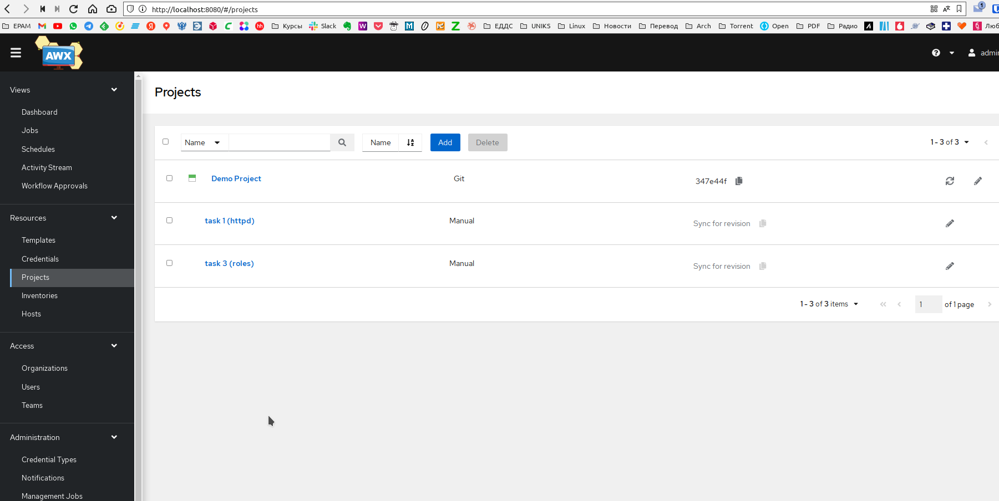
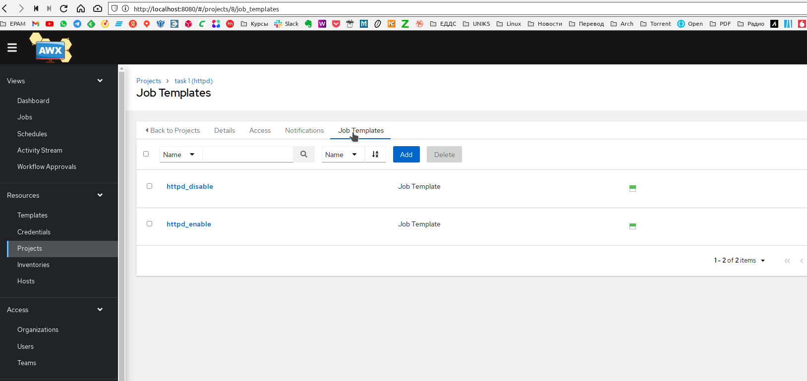
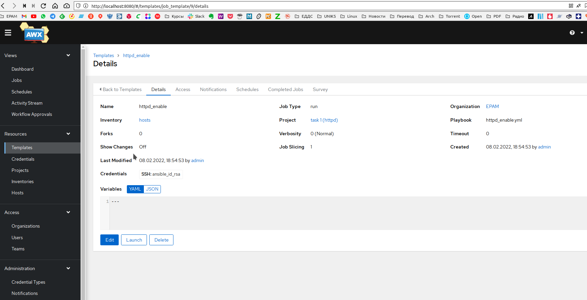
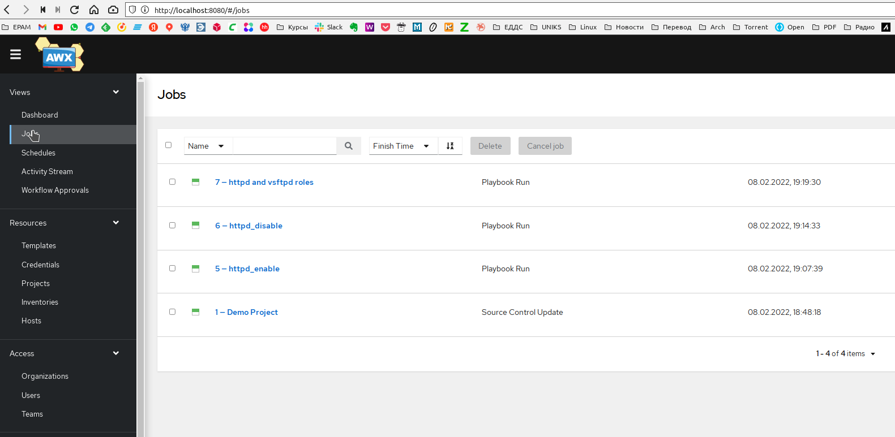
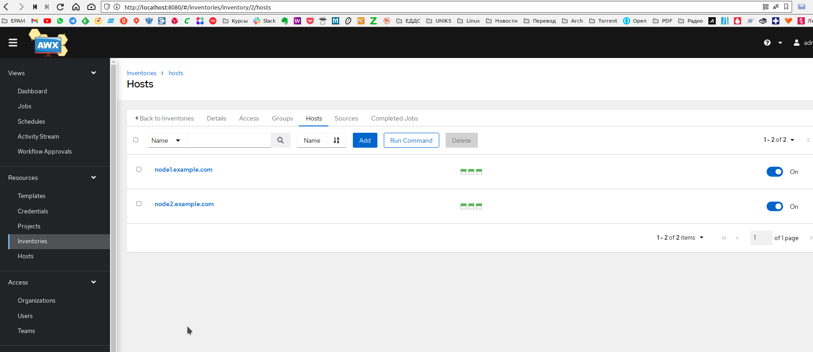
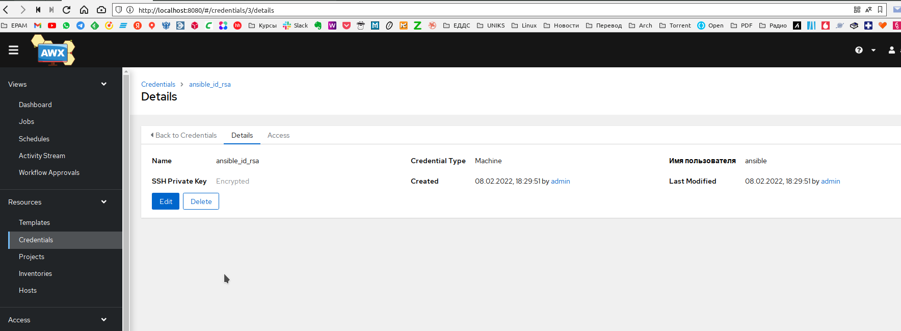
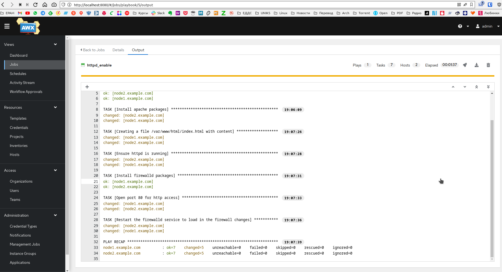
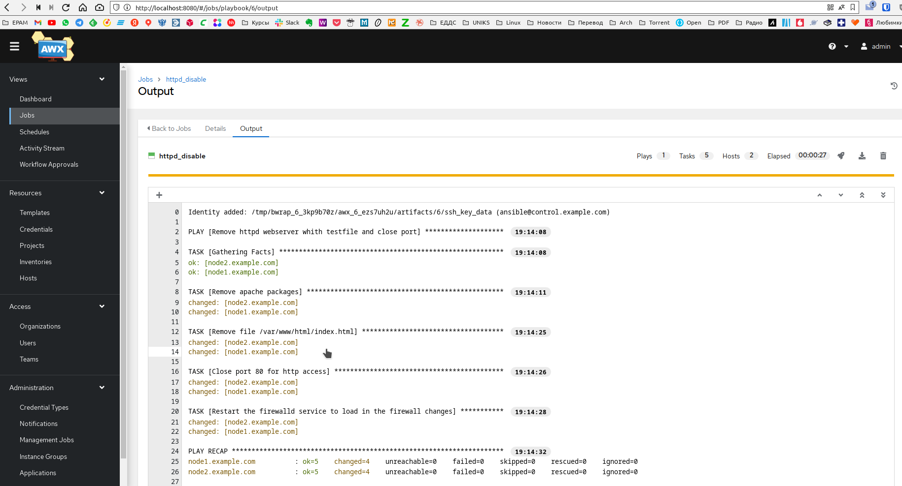
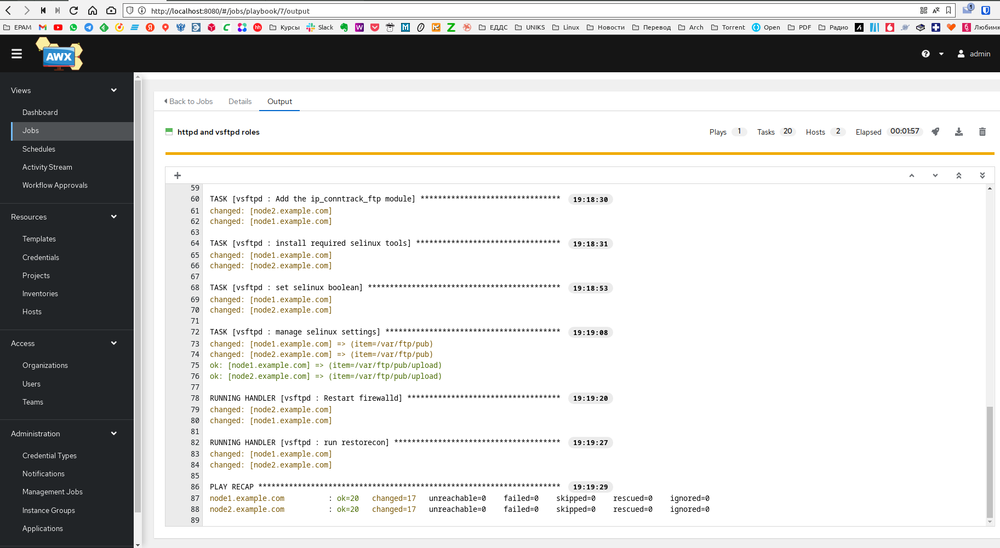
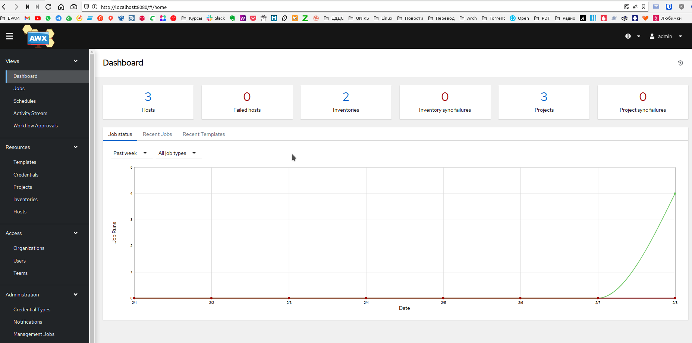

# EPAM [Lab] DevOps Internship #24

## Ansible Basics_Practice Task 4

### Задание 1

Установить у себя в окружении AWX, создать там проекты со своими плейбуками и ролями, запустить их.
В качестве результата нужно сделать скриншоты кода и результатов запуска.

**ОТВЕТ:**

  
  
  
  
  
  
  
  
  
  
