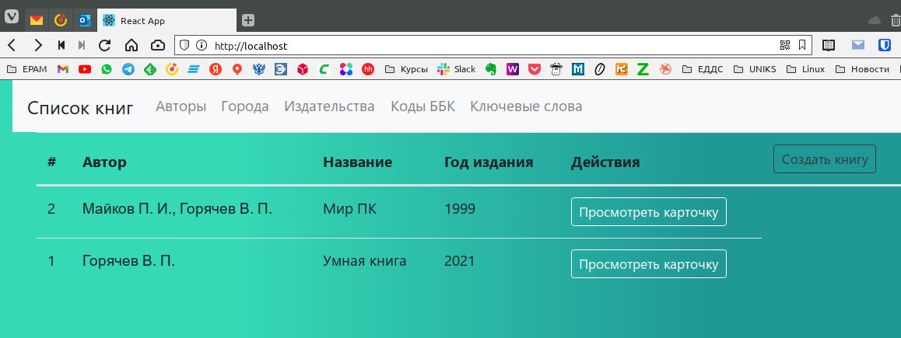

# EPAM [Lab] DevOps Internship #24

## docker_homework

## 1 Лекция

Написать Dockerfile для frontend располагается в директории /frontend, собрать и запустить

## 2 Лекция

Написать Dockerfile для backend который располагается в директории /lib_catalog(для сборки контейнера необходимо использовать файл /lib_catalog/requirements.txt), для работы backend необходим postgresql, т.е. необходимо собрать 2 контейнера:

1. backend
2. postgresql

Осуществить сетевые настройки, для работы связки backend и postgresql

## 3 Лекция

Написать docker-compose.yaml, для всего проекта, собрать и запустить

### Критерий оценки финального задания

1. Dockerfile должны быть написаны согласно пройденным best practices
2. Для docker-compose необходимо использовать локальное image registry
3. В docker-compose необходимо сетевые настройки 2 разных интерфейса(bridge), 1 - для фронта, 2 - для бека с postgresql

4.* Осуществить сборку проекта самим docker-compose команда docker-compose build (при использовании этого подхода необходимо исключить 2 пункт из критерии оценки)

#### ОТВЕТ

Создадим **[Dockerfile](./frontend/Dockerfile)** для frontend:

```bash
FROM node:14-alpine as builder
WORKDIR /frontend
COPY package*.json ./
RUN npm install
COPY . .
RUN npm run build

FROM nginx:1.20
WORKDIR /app
COPY --from=builder /frontend/build .
ADD demo.conf /etc/nginx/conf.d/default.conf
```

Создадим **[Dockerfile](./lib_catalog/Dockerfile)** для backend:

```bash
FROM python:3
ENV PYTHONDONTWRITEBYTECODE=1
ENV PYTHONUNBUFFERED=1
WORKDIR /code
RUN pip install --upgrade pip
COPY requirements.txt /code/
RUN pip install -r requirements.txt
COPY . .
RUN sed -i 's/ALLOWED_HOSTS = \[\]/ALLOWED_HOSTS = \["*"\]/g' /code/lib_catalog/settings.py \
    && echo "\nCORS_ORIGIN_ALLOW_ALL = True" >> /code/lib_catalog/settings.py
EXPOSE 8000 
ENTRYPOINT ["./docker-entrypoint.sh"]
```

Создадим **[Dockerfile](./database/Dockerfile)** для базы данных:

```bash
FROM postgres:14
ENV POSTGRES_NAME=django
ENV POSTGRES_USER=django
ENV POSTGRES_PASSWORD=django
EXPOSE 5432
```

Создадим **[docker-compose.yml](./docker-compose.yml)**:

```yaml
version: "3.9"
   
services:
  database:
    build: ./database
    ports:
      - "5432:5432"
    networks:
      back:
        ipv4_address: 172.16.238.4
    volumes:
      - /var/db/postgres_data:/var/lib/postgresql/data/

  backend:
    build: ./lib_catalog
    ports:
      - "8000:8000"
    depends_on:
      - database
    networks:
      back:
        ipv4_address: 172.16.238.3
      default:

  frontend:
    build: ./frontend
    ports:
      - "80:80"
    depends_on:
      - backend
      - database
    networks:
      default:

networks:
#Internal-only network for backend and database
  back:
    driver: bridge
    internal: true
    ipam:
     driver: default
     config:
       - subnet: 172.16.238.0/24
#External network for frontend and backend
  default:
    driver: bridge
```

Запустим всё это хозяйство, убедимся, что всё работает как надо, данные вносятся, сохраняются и благодаря подключенному внешнему тому не исчезают при перезапуске контейнеров.

```bash
wizard:docker_homework/ (master?) $ docker-compose up
[+] Running 5/3
 ? Network docker_homework_default       Created                                              0.1s
 ? Network docker_homework_back          Created                                              0.1s
 ? Container docker_homework-database-1  Created                                              0.1s
 ? Container docker_homework-backend-1   Created                                              0.0s
 ? Container docker_homework-frontend-1  Created                                              0.0s
Attaching to docker_homework-backend-1, docker_homework-database-1, docker_homework-frontend-1
docker_homework-database-1  |
docker_homework-database-1  | PostgreSQL Database directory appears to contain a database; Skipping initialization
docker_homework-database-1  |
docker_homework-database-1  | 2022-03-05 04:47:05.631 UTC [1] LOG:  starting PostgreSQL 14.2 (Debian 14.2-1.pgdg110+1) on x86_64-pc-linux-gnu, compiled by gcc (Debian 10.2.1-6) 10.2.1 20210110, 64-bit
docker_homework-database-1  | 2022-03-05 04:47:05.632 UTC [1] LOG:  listening on IPv4 address "0.0.0.0", port 5432
docker_homework-database-1  | 2022-03-05 04:47:05.632 UTC [1] LOG:  listening on IPv6 address "::", port 5432
docker_homework-database-1  | 2022-03-05 04:47:05.635 UTC [1] LOG:  listening on Unix socket "/var/run/postgresql/.s.PGSQL.5432"
docker_homework-database-1  | 2022-03-05 04:47:05.641 UTC [26] LOG:  database system was shut down at 2022-03-05 04:46:21 UTC
docker_homework-database-1  | 2022-03-05 04:47:05.647 UTC [1] LOG:  database system is ready to accept connections
docker_homework-backend-1   | Collect static files
docker_homework-frontend-1  | /docker-entrypoint.sh: /docker-entrypoint.d/ is not empty, will attempt to perform configuration
docker_homework-frontend-1  | /docker-entrypoint.sh: Looking for shell scripts in /docker-entrypoint.d/
docker_homework-frontend-1  | /docker-entrypoint.sh: Launching /docker-entrypoint.d/10-listen-on-ipv6-by-default.sh
docker_homework-frontend-1  | 10-listen-on-ipv6-by-default.sh: info: Getting the checksum of /etc/nginx/conf.d/default.conf
docker_homework-frontend-1  | 10-listen-on-ipv6-by-default.sh: info: /etc/nginx/conf.d/default.conf differs from the packaged version
docker_homework-frontend-1  | /docker-entrypoint.sh: Launching /docker-entrypoint.d/20-envsubst-on-templates.sh
docker_homework-frontend-1  | /docker-entrypoint.sh: Launching /docker-entrypoint.d/30-tune-worker-processes.sh
docker_homework-frontend-1  | /docker-entrypoint.sh: Configuration complete; ready for start up
docker_homework-frontend-1  | 2022/03/05 04:47:07 [notice] 1#1: using the "epoll" event method
docker_homework-frontend-1  | 2022/03/05 04:47:07 [notice] 1#1: nginx/1.20.2
docker_homework-frontend-1  | 2022/03/05 04:47:07 [notice] 1#1: built by gcc 10.2.1 20210110 (Debian 10.2.1-6)
docker_homework-frontend-1  | 2022/03/05 04:47:07 [notice] 1#1: OS: Linux 5.16.12-arch1-1
docker_homework-frontend-1  | 2022/03/05 04:47:07 [notice] 1#1: getrlimit(RLIMIT_NOFILE): 1048576:1048576
docker_homework-frontend-1  | 2022/03/05 04:47:07 [notice] 1#1: start worker processes
docker_homework-frontend-1  | 2022/03/05 04:47:07 [notice] 1#1: start worker process 30
docker_homework-frontend-1  | 2022/03/05 04:47:07 [notice] 1#1: start worker process 31
docker_homework-frontend-1  | 2022/03/05 04:47:07 [notice] 1#1: start worker process 32
docker_homework-frontend-1  | 2022/03/05 04:47:07 [notice] 1#1: start worker process 33
docker_homework-backend-1   | Traceback (most recent call last):
docker_homework-backend-1   | Apply database migrations
docker_homework-backend-1   | Operations to perform:
docker_homework-backend-1   |   Apply all migrations: admin, auth, catalog, contenttypes, sessions
docker_homework-backend-1   | Running migrations:
docker_homework-backend-1   |   No migrations to apply.
docker_homework-backend-1   | Starting server
docker_homework-backend-1   | Watching for file changes with StatReloader
docker_homework-backend-1   | Performing system checks...
docker_homework-backend-1   |
docker_homework-backend-1   | System check identified no issues (0 silenced).
docker_homework-backend-1   | March 05, 2022 - 04:47:10
docker_homework-backend-1   | Django version 3.0.7, using settings 'lib_catalog.settings'
docker_homework-backend-1   | Starting development server at http://0.0.0.0:8000/
docker_homework-backend-1   | Quit the server with CONTROL-C.

```


